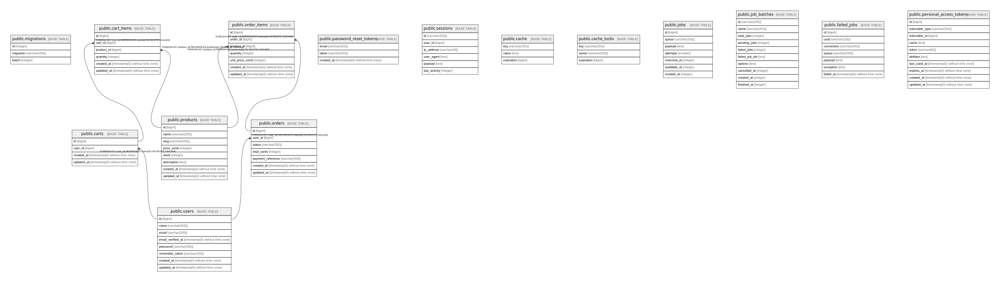

# scalable_ecommerce

## Tables

| Name | Columns | Comment | Type |
| ---- | ------- | ------- | ---- |
| [public.migrations](public.migrations.md) | 3 |  | BASE TABLE |
| [public.users](public.users.md) | 8 |  | BASE TABLE |
| [public.password_reset_tokens](public.password_reset_tokens.md) | 3 |  | BASE TABLE |
| [public.sessions](public.sessions.md) | 6 |  | BASE TABLE |
| [public.cache](public.cache.md) | 3 |  | BASE TABLE |
| [public.cache_locks](public.cache_locks.md) | 3 |  | BASE TABLE |
| [public.jobs](public.jobs.md) | 7 |  | BASE TABLE |
| [public.job_batches](public.job_batches.md) | 10 |  | BASE TABLE |
| [public.failed_jobs](public.failed_jobs.md) | 7 |  | BASE TABLE |
| [public.personal_access_tokens](public.personal_access_tokens.md) | 10 |  | BASE TABLE |
| [public.products](public.products.md) | 8 |  | BASE TABLE |
| [public.carts](public.carts.md) | 4 |  | BASE TABLE |
| [public.cart_items](public.cart_items.md) | 6 |  | BASE TABLE |
| [public.orders](public.orders.md) | 7 |  | BASE TABLE |
| [public.order_items](public.order_items.md) | 7 |  | BASE TABLE |

## Relations

---

> Generated by [tbls](https://github.com/k1LoW/tbls)
