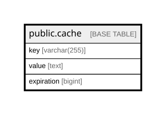

# public.cache

## Columns

| Name | Type | Default | Nullable | Children | Parents | Comment |
| ---- | ---- | ------- | -------- | -------- | ------- | ------- |
| key | varchar(255) |  | false |  |  |  |
| value | text |  | false |  |  |  |
| expiration | bigint |  | false |  |  |  |

## Constraints

| Name | Type | Definition |
| ---- | ---- | ---------- |
| cache_expiration_not_null | n | NOT NULL expiration |
| cache_key_not_null | n | NOT NULL key |
| cache_value_not_null | n | NOT NULL value |
| cache_pkey | PRIMARY KEY | PRIMARY KEY (key) |

## Indexes

| Name | Definition |
| ---- | ---------- |
| cache_pkey | CREATE UNIQUE INDEX cache_pkey ON public.cache USING btree (key) |
| cache_expiration_index | CREATE INDEX cache_expiration_index ON public.cache USING btree (expiration) |

## Relations

---

> Generated by [tbls](https://github.com/k1LoW/tbls)
