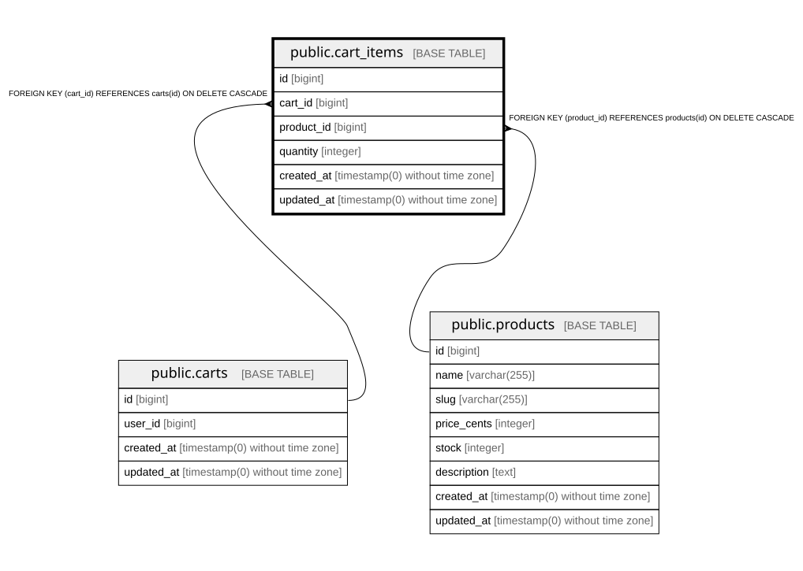

# public.cart_items

## Columns

| Name | Type | Default | Nullable | Children | Parents | Comment |
| ---- | ---- | ------- | -------- | -------- | ------- | ------- |
| id | bigint | nextval('cart_items_id_seq'::regclass) | false |  |  |  |
| cart_id | bigint |  | false |  | [public.carts](public.carts.md) |  |
| product_id | bigint |  | false |  | [public.products](public.products.md) |  |
| quantity | integer |  | false |  |  |  |
| created_at | timestamp(0) without time zone |  | true |  |  |  |
| updated_at | timestamp(0) without time zone |  | true |  |  |  |

## Constraints

| Name | Type | Definition |
| ---- | ---- | ---------- |
| cart_items_cart_id_not_null | n | NOT NULL cart_id |
| cart_items_id_not_null | n | NOT NULL id |
| cart_items_product_id_not_null | n | NOT NULL product_id |
| cart_items_quantity_not_null | n | NOT NULL quantity |
| cart_items_product_id_foreign | FOREIGN KEY | FOREIGN KEY (product_id) REFERENCES products(id) ON DELETE CASCADE |
| cart_items_cart_id_foreign | FOREIGN KEY | FOREIGN KEY (cart_id) REFERENCES carts(id) ON DELETE CASCADE |
| cart_items_pkey | PRIMARY KEY | PRIMARY KEY (id) |
| cart_items_cart_id_product_id_unique | UNIQUE | UNIQUE (cart_id, product_id) |

## Indexes

| Name | Definition |
| ---- | ---------- |
| cart_items_pkey | CREATE UNIQUE INDEX cart_items_pkey ON public.cart_items USING btree (id) |
| cart_items_cart_id_product_id_unique | CREATE UNIQUE INDEX cart_items_cart_id_product_id_unique ON public.cart_items USING btree (cart_id, product_id) |

## Relations

---

> Generated by [tbls](https://github.com/k1LoW/tbls)
