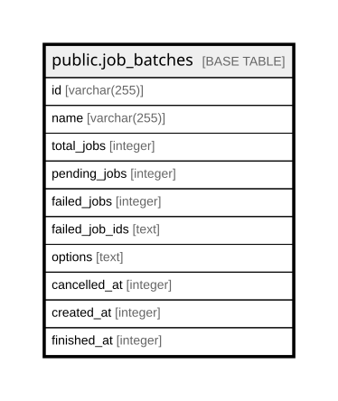

# public.job_batches

## Columns

| Name | Type | Default | Nullable | Children | Parents | Comment |
| ---- | ---- | ------- | -------- | -------- | ------- | ------- |
| id | varchar(255) |  | false |  |  |  |
| name | varchar(255) |  | false |  |  |  |
| total_jobs | integer |  | false |  |  |  |
| pending_jobs | integer |  | false |  |  |  |
| failed_jobs | integer |  | false |  |  |  |
| failed_job_ids | text |  | false |  |  |  |
| options | text |  | true |  |  |  |
| cancelled_at | integer |  | true |  |  |  |
| created_at | integer |  | false |  |  |  |
| finished_at | integer |  | true |  |  |  |

## Constraints

| Name | Type | Definition |
| ---- | ---- | ---------- |
| job_batches_created_at_not_null | n | NOT NULL created_at |
| job_batches_failed_job_ids_not_null | n | NOT NULL failed_job_ids |
| job_batches_failed_jobs_not_null | n | NOT NULL failed_jobs |
| job_batches_id_not_null | n | NOT NULL id |
| job_batches_name_not_null | n | NOT NULL name |
| job_batches_pending_jobs_not_null | n | NOT NULL pending_jobs |
| job_batches_total_jobs_not_null | n | NOT NULL total_jobs |
| job_batches_pkey | PRIMARY KEY | PRIMARY KEY (id) |

## Indexes

| Name | Definition |
| ---- | ---------- |
| job_batches_pkey | CREATE UNIQUE INDEX job_batches_pkey ON public.job_batches USING btree (id) |

## Relations

---

> Generated by [tbls](https://github.com/k1LoW/tbls)
