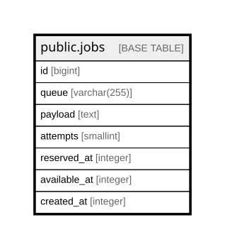

# public.jobs

## Columns

| Name | Type | Default | Nullable | Children | Parents | Comment |
| ---- | ---- | ------- | -------- | -------- | ------- | ------- |
| id | bigint | nextval('jobs_id_seq'::regclass) | false |  |  |  |
| queue | varchar(255) |  | false |  |  |  |
| payload | text |  | false |  |  |  |
| attempts | smallint |  | false |  |  |  |
| reserved_at | integer |  | true |  |  |  |
| available_at | integer |  | false |  |  |  |
| created_at | integer |  | false |  |  |  |

## Constraints

| Name | Type | Definition |
| ---- | ---- | ---------- |
| jobs_attempts_not_null | n | NOT NULL attempts |
| jobs_available_at_not_null | n | NOT NULL available_at |
| jobs_created_at_not_null | n | NOT NULL created_at |
| jobs_id_not_null | n | NOT NULL id |
| jobs_payload_not_null | n | NOT NULL payload |
| jobs_queue_not_null | n | NOT NULL queue |
| jobs_pkey | PRIMARY KEY | PRIMARY KEY (id) |

## Indexes

| Name | Definition |
| ---- | ---------- |
| jobs_pkey | CREATE UNIQUE INDEX jobs_pkey ON public.jobs USING btree (id) |
| jobs_queue_index | CREATE INDEX jobs_queue_index ON public.jobs USING btree (queue) |

## Relations

---

> Generated by [tbls](https://github.com/k1LoW/tbls)
