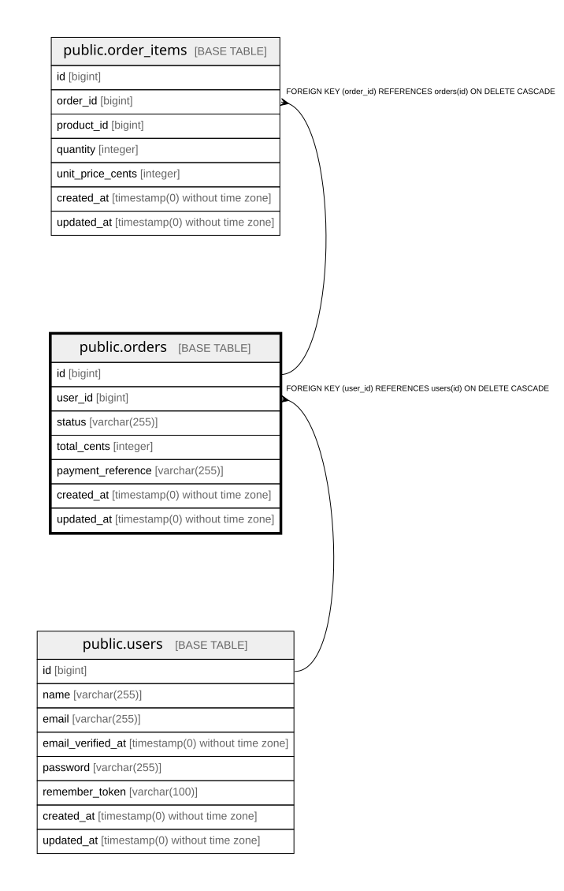

# public.orders

## Columns

| Name | Type | Default | Nullable | Children | Parents | Comment |
| ---- | ---- | ------- | -------- | -------- | ------- | ------- |
| id | bigint | nextval('orders_id_seq'::regclass) | false | [public.order_items](public.order_items.md) |  |  |
| user_id | bigint |  | false |  | [public.users](public.users.md) |  |
| status | varchar(255) |  | false |  |  |  |
| total_cents | integer |  | false |  |  |  |
| payment_reference | varchar(255) |  | true |  |  |  |
| created_at | timestamp(0) without time zone |  | true |  |  |  |
| updated_at | timestamp(0) without time zone |  | true |  |  |  |

## Constraints

| Name | Type | Definition |
| ---- | ---- | ---------- |
| orders_id_not_null | n | NOT NULL id |
| orders_status_not_null | n | NOT NULL status |
| orders_total_cents_not_null | n | NOT NULL total_cents |
| orders_user_id_not_null | n | NOT NULL user_id |
| orders_user_id_foreign | FOREIGN KEY | FOREIGN KEY (user_id) REFERENCES users(id) ON DELETE CASCADE |
| orders_pkey | PRIMARY KEY | PRIMARY KEY (id) |

## Indexes

| Name | Definition |
| ---- | ---------- |
| orders_pkey | CREATE UNIQUE INDEX orders_pkey ON public.orders USING btree (id) |

## Relations

---

> Generated by [tbls](https://github.com/k1LoW/tbls)
