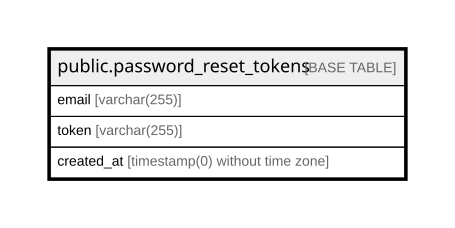

# public.password_reset_tokens

## Columns

| Name | Type | Default | Nullable | Children | Parents | Comment |
| ---- | ---- | ------- | -------- | -------- | ------- | ------- |
| email | varchar(255) |  | false |  |  |  |
| token | varchar(255) |  | false |  |  |  |
| created_at | timestamp(0) without time zone |  | true |  |  |  |

## Constraints

| Name | Type | Definition |
| ---- | ---- | ---------- |
| password_reset_tokens_email_not_null | n | NOT NULL email |
| password_reset_tokens_token_not_null | n | NOT NULL token |
| password_reset_tokens_pkey | PRIMARY KEY | PRIMARY KEY (email) |

## Indexes

| Name | Definition |
| ---- | ---------- |
| password_reset_tokens_pkey | CREATE UNIQUE INDEX password_reset_tokens_pkey ON public.password_reset_tokens USING btree (email) |

## Relations

---

> Generated by [tbls](https://github.com/k1LoW/tbls)
