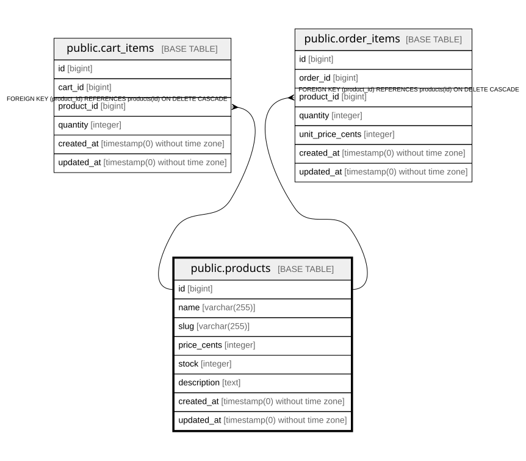

# public.products

## Columns

| Name | Type | Default | Nullable | Children | Parents | Comment |
| ---- | ---- | ------- | -------- | -------- | ------- | ------- |
| id | bigint | nextval('products_id_seq'::regclass) | false | [public.cart_items](public.cart_items.md) [public.order_items](public.order_items.md) |  |  |
| name | varchar(255) |  | false |  |  |  |
| slug | varchar(255) |  | false |  |  |  |
| price_cents | integer |  | false |  |  |  |
| stock | integer | 0 | false |  |  |  |
| description | text |  | true |  |  |  |
| created_at | timestamp(0) without time zone |  | true |  |  |  |
| updated_at | timestamp(0) without time zone |  | true |  |  |  |

## Constraints

| Name | Type | Definition |
| ---- | ---- | ---------- |
| products_id_not_null | n | NOT NULL id |
| products_name_not_null | n | NOT NULL name |
| products_price_cents_not_null | n | NOT NULL price_cents |
| products_slug_not_null | n | NOT NULL slug |
| products_stock_not_null | n | NOT NULL stock |
| products_pkey | PRIMARY KEY | PRIMARY KEY (id) |
| products_slug_unique | UNIQUE | UNIQUE (slug) |

## Indexes

| Name | Definition |
| ---- | ---------- |
| products_pkey | CREATE UNIQUE INDEX products_pkey ON public.products USING btree (id) |
| products_slug_unique | CREATE UNIQUE INDEX products_slug_unique ON public.products USING btree (slug) |

## Relations

---

> Generated by [tbls](https://github.com/k1LoW/tbls)
