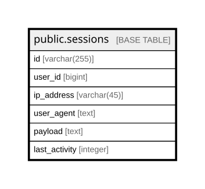

# public.sessions

## Columns

| Name | Type | Default | Nullable | Children | Parents | Comment |
| ---- | ---- | ------- | -------- | -------- | ------- | ------- |
| id | varchar(255) |  | false |  |  |  |
| user_id | bigint |  | true |  |  |  |
| ip_address | varchar(45) |  | true |  |  |  |
| user_agent | text |  | true |  |  |  |
| payload | text |  | false |  |  |  |
| last_activity | integer |  | false |  |  |  |

## Constraints

| Name | Type | Definition |
| ---- | ---- | ---------- |
| sessions_id_not_null | n | NOT NULL id |
| sessions_last_activity_not_null | n | NOT NULL last_activity |
| sessions_payload_not_null | n | NOT NULL payload |
| sessions_pkey | PRIMARY KEY | PRIMARY KEY (id) |

## Indexes

| Name | Definition |
| ---- | ---------- |
| sessions_pkey | CREATE UNIQUE INDEX sessions_pkey ON public.sessions USING btree (id) |
| sessions_user_id_index | CREATE INDEX sessions_user_id_index ON public.sessions USING btree (user_id) |
| sessions_last_activity_index | CREATE INDEX sessions_last_activity_index ON public.sessions USING btree (last_activity) |

## Relations

---

> Generated by [tbls](https://github.com/k1LoW/tbls)
